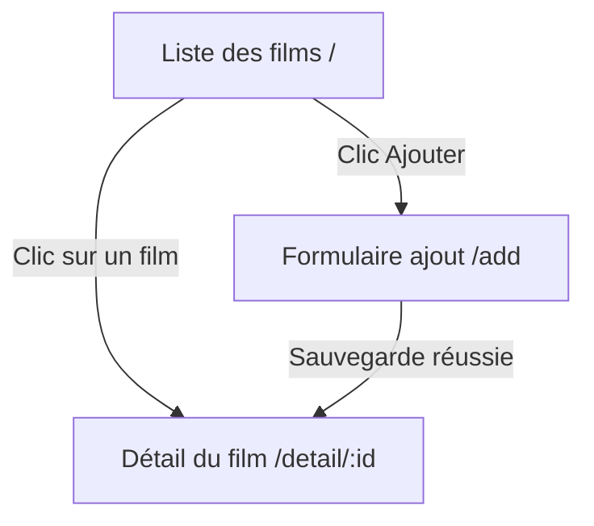
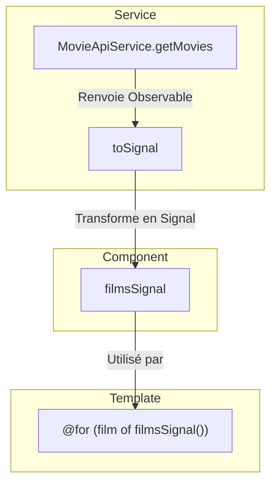
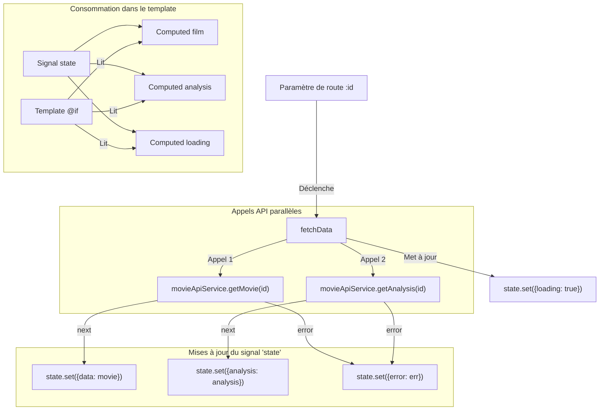
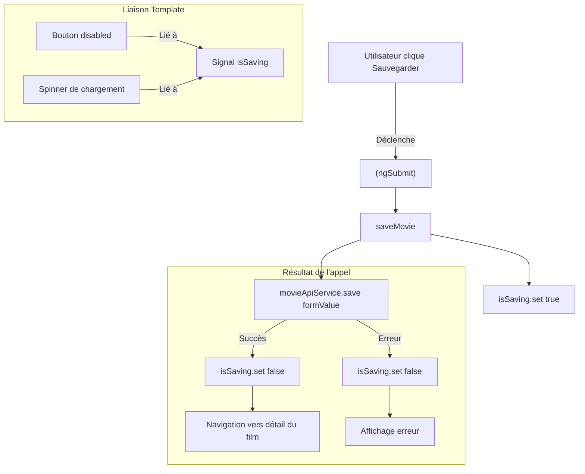

# TP - Videotheque

L'objectif est de mettre en pratique les concepts modernes d'Angular, notamment les **Signals**, pour construire une petite application de gestion de films.

Vous partirez d'une base de code existante qui inclut déjà toute la configuration de l'application et les services de communication avec les APIs (REST et GraphQL).

Votre mission sera de compléter la logique des composants pour rendre l'application fonctionnelle.

## Objectifs Pédagogiques

À la fin de ce TP, vous saurez :

1.  **Consommer des Observables** et les transformer en **Signals** avec `toSignal`.
2.  Gérer l'état d'un composant (données, chargement, erreur) à l'aide d'un **Signal** unique.
3.  Utiliser des **Signals `computed`** pour dériver des données de l'état principal.
4.  Déclencher des appels asynchrones et gérer leurs cycles de vie avec `effect`.
5.  Interagir avec des services pour récupérer et envoyer des données.
6.  Utiliser la nouvelle syntaxe de template (`@if`, `@for`) pour afficher des données réactives.
7.  Mettre en place et gérer un **formulaire réactif** dans un contexte moderne.

## Installation

1. Ouvrir le projet sous WebStorm.
2. Ouvrir un terminal dans WebStorm.
3. Lancer la commande `npm install` pour installer les dépendances.
4. Lancer la commande `ng serve` pour démarrer le serveur de développement.
5. Ouvrir le navigateur à l'adresse `http://localhost:4200/`.

Note : les services APIs (fournis séparément) doivent être en cours d'exécution.

## Votre mission

Votre travail consistera à chercher les commentaires `// TODO:` dans les fichiers du dossier `src/app/features/movie` et à implémenter la logique manquante.

Voici un aperçu de la navigation entre les fonctionnalités que vous allez construire :

### Étape 1 : afficher la liste des films

Le premier objectif est d'afficher la liste des films sur la page d'accueil.

**Fichiers à modifier :**
* `src/app/features/movie/movie-list/movie-list.component.ts`
* `src/app/features/movie/movie-list/movie-list.component.html`

**Instructions :**
1.  Dans le `component.ts`, utilisez `toSignal` pour transformer le flux de données provenant de `MovieApiService` en un signal.
2.  Dans le `component.html`, utilisez une boucle `@for` pour itérer sur le signal de films et afficher chaque film dans la liste.

**Logique attendue pour l'étape 1 :**

### Étape 2 : afficher le détail d'un film

Quand un utilisateur clique sur un film, il doit voir une page de détail avec les informations du film et une analyse générée par une IA (simulée par une API GraphQL plus lente).

**Fichiers à modifier :**
* `src/app/features/movie/movie-detail/movie-detail.component.ts`
* `src/app/features/movie/movie-detail/movie-detail.component.html`

**Instructions :**
1.  Dans le `component.ts`, complétez les signaux `computed` pour extraire les données (film, analyse, état de chargement) du signal d'état principal `state`.
2.  Complétez la méthode `fetchData` pour mettre à jour le signal `state` dans les callbacks `next` et `error` des deux appels API.
3.  Dans le `component.html`, utilisez des blocs `@if` pour gérer les états de chargement et afficher les données des signaux que vous venez de créer.

**Logique attendue pour l'étape 2 :**

-----

### Étape 3 : Créer le formulaire d'ajout

Enfin, vous allez rendre le formulaire de création de film fonctionnel.

**Fichiers à modifier :**
* `src/app/features/movie/movie-form/movie-form.component.ts`
* `src/app/features/movie/movie-form/movie-form.component.html`

**Instructions :**
1.  Dans le `component.ts`, utilisez `toSignal` pour récupérer les listes de genres et de participants nécessaires pour les listes déroulantes du formulaire.
2.  Créez un signal `isSaving` pour suivre l'état de la soumission du formulaire.
3.  Implémentez la logique de la méthode `saveMovie` pour appeler le service, mettre à jour le signal `isSaving`, et naviguer vers la page du film nouvellement créé en cas de succès.
4.  Dans le `component.html`, liez les contrôles de formulaire, gérez l'événement `(ngSubmit)` et utilisez le signal `isSaving` pour afficher un message de chargement et désactiver le bouton de soumission.

**Logique attendue pour l'étape 3 :**

Bon courage !
